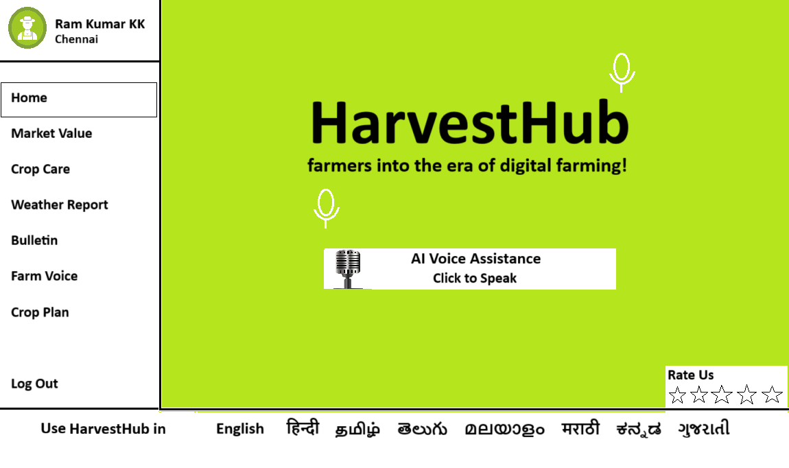

# Smart India Hackathon Workshop
# Date: 28.09.2025
## Register Number: 25018817
## Name: Janesha S
## Problem Title
SIH 25010: Smart Crop Advisory System for Small and Marginal Farmers
## Problem Description
A majority of small and marginal farmers in India rely on traditional knowledge, local shopkeepers, or guesswork for crop selection, pest control, and fertilizer use. They lack access to personalized, real-time advisory services that account for soil type, weather conditions, and crop history. This often leads to poor yield, excessive input costs, and environmental degradation due to overuse of chemicals. Language barriers, low digital literacy, and absence of localized tools further limit their access to modern agri-tech resources.

Impact / Why this problem needs to be solved

Helping small farmers make informed decisions can significantly increase productivity, reduce costs, and improve livelihoods. It also contributes to sustainable farming practices, food security, and environmental conservation. A smart advisory solution can empower farmers with scientific insights in their native language and reduce dependency on unreliable third-party advice.

Expected Outcomes

• A multilingual, AI-based mobile app or chatbot that provides real-time, location-specific crop advisory.
• Soil health recommendations and fertilizer guidance.
• Weather-based alerts and predictive insights.
• Pest/disease detection via image uploads.
• Market price tracking.
• Voice support for low-literate users.
• Feedback and usage data collection for continuous improvement.

Relevant Stakeholders / Beneficiaries

• Small and marginal farmers
• Agricultural extension officers
• Government agriculture departments
• NGOs and cooperatives
• Agri-tech startups

Supporting Data

• 86% of Indian farmers are small or marginal (NABARD Report, 2022).
• Studies show ICT-based advisories can increase crop yield by 20–30%.

## Problem Creater's Organization
Government of Punjab

## Theme
Agriculture, FoodTech & Rural Development

## Proposed Solution
<h3>Smart AI-driven application for small and marginal farmers:</h3>

## Technical Approach
<h3>Technologies to be used</h3>
<ul><li>Front-End:- React.js</li>
<li>Back-End:- Node.js</li>
<li>Programming Logic:- Javascript</li></ul>

## Feasibility and Viability
<h3>Feasibility of this idea</h3>
<ul><li>Government Support, Growing Connectivity, Succesful Pilot, Digital Tools in Action</li></ul>
<h3>Potential challenges and risks</h3>
<ul><li>Limited internet access, Electricity Issue, Low digital Literacy, Resistance to Change </li></ul>

## Impact and Benefits
<h3>Remove These Lines</h3>
<ul><li>Helps farmers take critical decisions in their farming business to increase profitability.</li>
<li>Improved and increased productivity, cost efficiency, and social and cultural benifits.</li></ul>

## Research and References
<h3>Links of the reference and research work</h3>
<ul><li>https://www.globalagricentral.com/</li>
<li>https://www.agrifarming.in/</li>
</ul>
